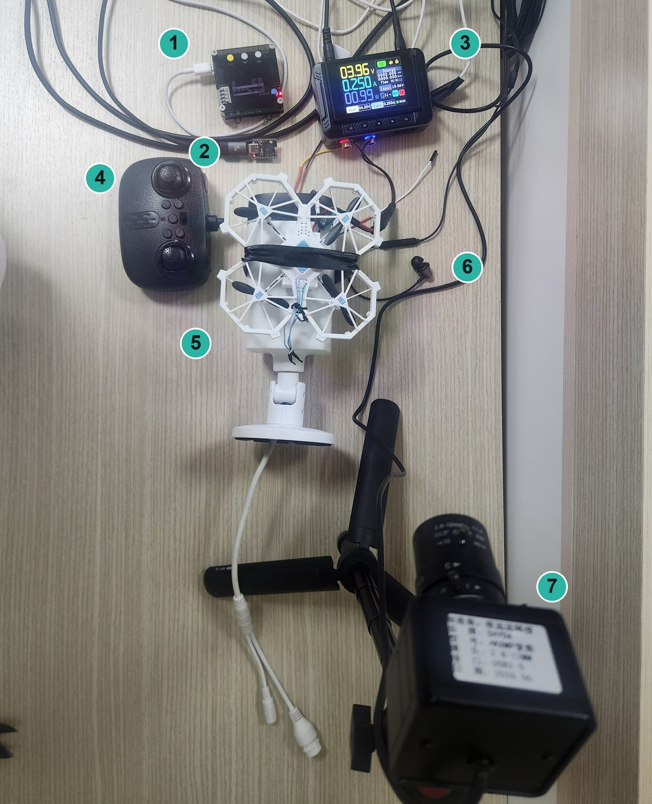
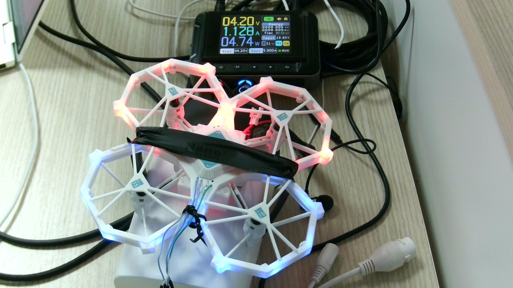
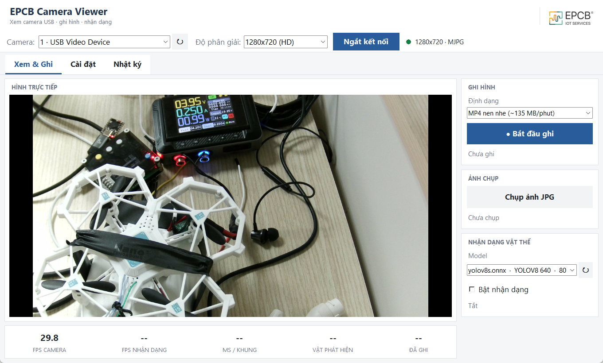
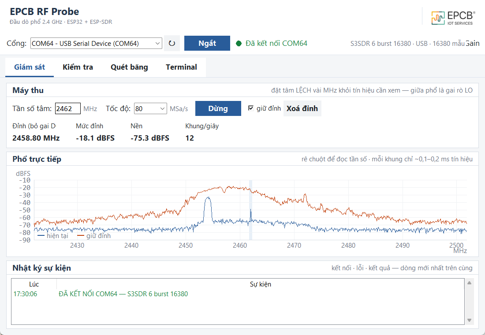
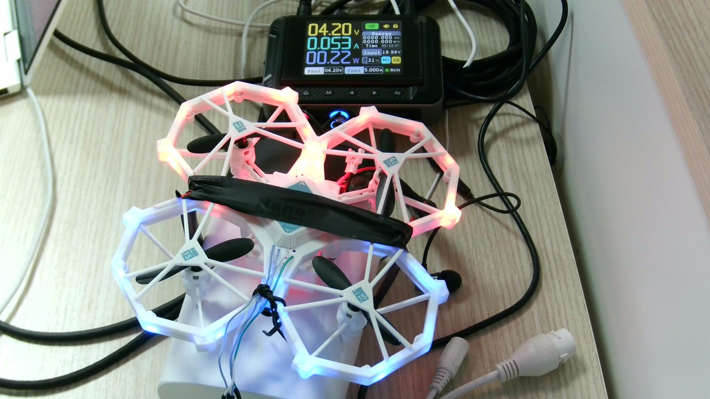
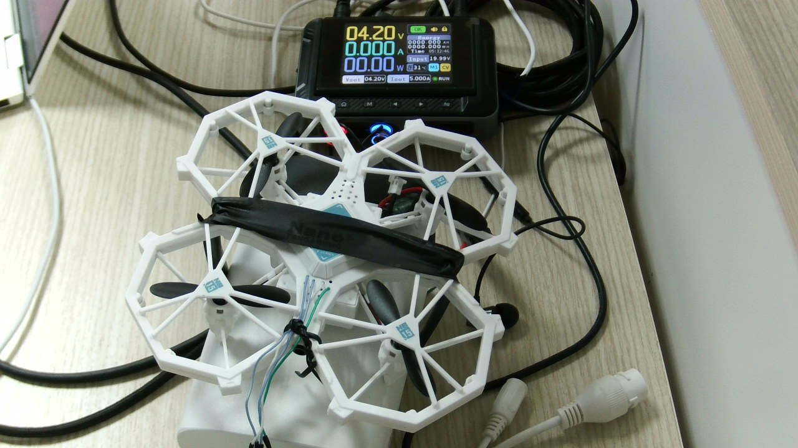
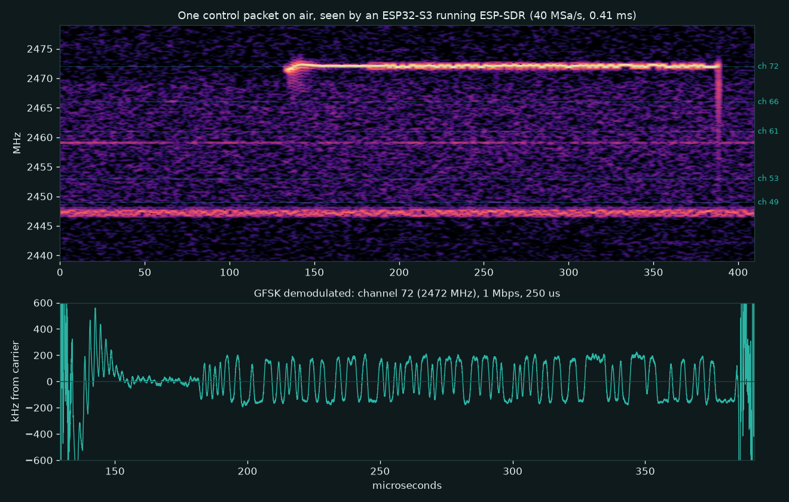
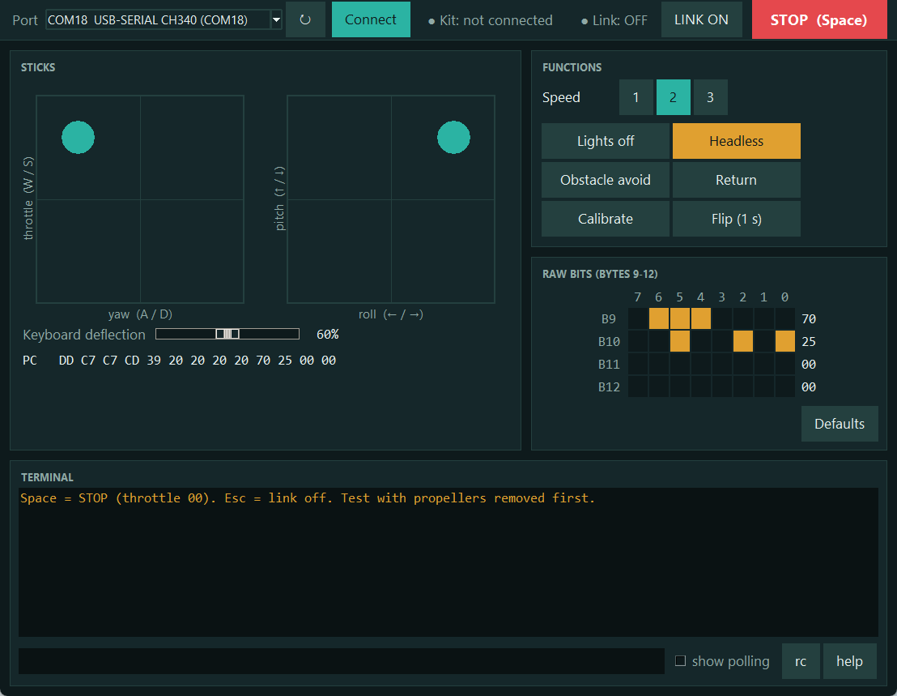

# Lái drone đồ chơi từ máy tính — dò ngược giao thức 2,4 GHz bằng Claude Code và AK Base Kit

Một drone đồ chơi **Vecto Flying Angel VTY15** mua ngoài cửa hàng, không có tài liệu kỹ thuật, chip
không ghi tên. Sau năm ngày (04–08/10/2026) nó **cất cánh và bay theo lệnh từ một app trên máy tính**,
qua một bo [AK Base Kit](https://github.com/the-ak-foundation/ak-base-kit-stm32l151) có gắn nRF24L01+.
Không sửa firmware trên drone.

Repo này ghi lại giao thức đã giải mã, và cũng là một ví dụ về cách làm việc: phần lớn firmware,
phép đo, phân tích và tài liệu do **[Claude Code](https://claude.com/claude-code)** làm, điều khiển
trực tiếp các dụng cụ có sẵn trên bàn; người làm phần cứng lo những việc cần tay và mắt.

*A toy quadcopter with unmarked chips, reverse engineered in five days down to flying it from a PC
app through a plain nRF24L01+. Most of the firmware, measurements, analysis and writing were done by
Claude Code driving off-the-shelf bench tools; a hardware engineer did the soldering and the
watching. Documentation is in Vietnamese; the protocol tables in
[`docs/protocol.md`](docs/protocol.md) are readable without it.*

<p>
  
  
</p>

*Trái: bàn thử — (1) AK Base Kit 2.1 phát lệnh · (2) ESP32-S3 nghe sóng · (3) nguồn lập trình ·
(4) tay điều khiển gốc · (5) drone · (6) micro · (7) camera USB. Phải: camera của bàn thử chụp lúc bốn
motor đang quay theo lệnh từ máy tính.*

## Kết quả

| Hạng mục | Tình trạng |
|---|---|
| Định dạng sóng | Đã giải mã: GFSK 1 Mbps, khung kiểu HS6200, bảng xáo trộn 15 byte, CRC-16 |
| Ghép cặp và nhảy tần | Đã giải mã: kênh ghép cặp 75, năm kênh nhảy tần lấy từ gói ghép cặp, 16 ms một kênh |
| Gói điều khiển 13 byte | Ga, roll, pitch, yaw và các cờ tốc độ, đèn, headless, tránh vật cản, reset, dừng motor, tắt nguồn đã có vị trí |
| Phát từ nRF24L01+ | Drone ghép cặp và đọc đúng từng byte; một máy thu độc lập (ESP32-S3) giải ra đúng gói, CRC khớp |
| **Bay thật từ máy tính (08/10/2026)** | **Cất cánh, nghiêng trái/phải, tiến/lùi, bật tắt đèn và chế độ tránh vật cản hoạt động.** Xoay (yaw), hạ cánh và nút STOP lúc đang bay chưa ghi nhận |
| Chưa rõ | Byte 5–9, vài bit cờ, tên chip radio và MCU |

```
byte   0   1   2   3   4   5   6   7   8   9  10  11  12
      DD  80  80  83  80  20  20  20  20  70  04  00  00
      cờ roll pitch ga yaw  └── chưa rõ ──┘     └─ cờ nút ─┘
```

Đặc tả đầy đủ, mỗi mục ghi mức chắc chắn: **[`docs/protocol.md`](docs/protocol.md)**.

## Ai làm gì

| Người làm phần cứng | Claude Code |
|---|---|
| Mua drone, mở vỏ, chụp ảnh bo mạch | Đọc ảnh bo, đề xuất hướng đi và trình tự đo |
| Hàn dây vào chip radio, đo bằng đồng hồ | Viết firmware cho AK Base Kit: bộ bắt SPI, lệnh nghe/phát nRF24, tay điều khiển có menu OLED |
| Cắm thiết bị, bật nguồn, bấm nút trên tay điều khiển gốc | Build, nạp firmware qua console UART, chạy từng phép đo và đọc kết quả |
| Hàn tụ, rút ngắn dây nguồn, dán cố định drone | Tìm bảng xáo trộn và công thức CRC từ gói thô; dựng lại khung và phát thử |
| Quan sát đèn và motor khi chưa có camera | Viết app điều khiển trên PC; điều khiển nguồn, camera, micro và máy thu SDR để tự đo |
| Quyết định hướng đi, cho phép từng lần quay motor, **lái chuyến bay đầu tiên** | Viết tài liệu trong repo này |

Phần của người không thay được: không có ai hàn ba sợi dây vào một chip SOP-8 thì không có dữ liệu
nào để phân tích. Phần của AI là rút ngắn mọi thứ nằm giữa hai lần hàn.

## Bộ dụng cụ, và vì sao AI dùng được chúng

Điểm chung của mọi thứ trên bàn: **đều điều khiển được bằng lệnh qua cổng nối tiếp hoặc USB**. Đó là
điều kiện để một trợ lý lập trình tự chạy phép đo thay vì chỉ viết mã rồi chờ người bấm.

| Dụng cụ | Vai trò | Claude Code điều khiển bằng |
|---|---|---|
| [AK Base Kit](https://github.com/the-ak-foundation/ak-base-kit-stm32l151) 3.0 (STM32L151) | Bắt SPI giữa MCU và chip radio của drone | Lệnh `spi` trên console; firmware tự viết thêm |
| AK Base Kit 2.1 (có nRF24L01+ và OLED) | Nghe sóng, rồi phát lệnh tới drone; tay điều khiển thử nghiệm | Lệnh `rf`, `rc` trên console; nạp firmware qua console |
| Firmware [ak-mcu-base](https://github.com/hohoanganh/ak-mcu-base) | Nền cho cả hai kit: kernel AK hướng sự kiện, shell, cập nhật firmware qua UART | Sửa mã, build bằng PlatformIO, nạp bằng `ak_fw.py` |
| Nguồn lập trình FNIRSI DPS-150 | Cấp điện cho drone, đo dòng theo từng lệnh, sạc pin | Thư viện Python qua USB |
| Camera USB | Kiểu nháy đèn, từng cánh quay hay dừng | OpenCV |
| Micro USB | Tần số tiếng motor, tức tốc độ quay | Ghi âm và phân tích phổ |
| ESP32-S3 chạy [ESP-SDR](https://github.com/ESPARGOS/esp-sdr) | Gói tin thật trên sóng, cả năm kênh nhảy tần cùng lúc | Lệnh chụp I/Q qua USB, giải điều chế bằng phần mềm |

AK Base Kit là bo phát triển mã nguồn mở của [AK Foundation](https://github.com/the-ak-foundation);
`ak-mcu-base` là nền firmware dựng lại từ dự án đó. Kit hợp với kiểu làm việc này vì ba lý do: có
shell trên UART để thêm lệnh đo trong vài chục dòng, nạp firmware được ngay qua chính cổng đó mà
không cần mạch nạp, và mã phía trên lớp phần cứng chạy được cả trên máy tính để kiểm trước khi nạp.
Hai bản build dùng ở đây là `kit_tools` và `remote`.

<p>
  
  
</p>

*Hai app có sẵn dùng kèm lúc đo: xem camera USB (trái) và đầu dò phổ 2,4 GHz trên ESP-SDR (phải, một
gói vừa xuất hiện ở 2453 MHz, nền là Wi-Fi).*

## Cách làm, qua bốn đoạn

**1. Bắt SPI rồi nghe sóng.** Ba sợi dây hàn vào chip radio SOP-8 không chữ của drone, nối sang một
AK Base Kit làm SPI slave chỉ nhận. Từ chuỗi khởi tạo đọc ra địa chỉ, kênh và từng gói drone nhận
được. Có địa chỉ và kênh rồi, nRF24L01+ nghe được gói thô trên sóng; so hai nguồn với nhau thì ra bảng
xáo trộn và công thức CRC. Gói tự dựng phát đi phải hiện đúng từng byte ở phía drone.

**2. Kit 2.1 thành tay điều khiển.** Một menu 44 mục trên OLED, mỗi mục đổi một trường hoặc một bit
của gói, để thử từng thứ một trên drone thật. Sau đó thêm ba lệnh console để máy tính đặt thẳng gói
và một bộ canh: máy tính ngừng gửi quá 0,5 giây thì kit tự phát ga `00`.
[`docs/remote-ak-kit-2.1.md`](docs/remote-ak-kit-2.1.md)


**3. Bàn thử tự đo.** Drone dán cố định, chạy bằng nguồn lập trình. Máy tính phát lệnh rồi tự đọc dòng
điện, nhìn đèn và cánh bằng camera, nghe tiếng motor bằng micro. Nhờ vậy tìm ra những thứ mắt thường
khó thấy: ngưỡng ga làm motor khởi động, bit làm drone tắt nguồn hẳn, drone coi là mất sóng sau
khoảng 2 giây, và vì sao nó cứ tự tắt khi chạy bằng nguồn bàn (sụt áp; thêm tụ và pin là hết).
[`docs/bench-power.md`](docs/bench-power.md)

<p>
  
  
  
</p>

*Camera của bàn thử: drone nghỉ (0,05 A) · bốn motor quay (1,13 A) · drone vừa tự tắt nguồn (0 A).*

**4. Kiểm trên sóng bằng một máy thu độc lập.** ESP32-S3 chạy ESP-SDR chụp I/Q 40 triệu mẫu mỗi
giây; script giải điều chế GFSK và giải khung. Gói của bộ phát thử ra đúng 13 byte với CRC khớp, và
gói của tay điều khiển gốc lúc nghỉ trùng từng byte. Khác nhau ở tầng sóng: độ lệch tần ±167 kHz so
với ±275 kHz, và tay gốc xen kẽ byte 0 `DD` / `D5`.



*Một gói điều khiển trên sóng: sóng mang bật ở kênh 72, ổn định khoảng 40 µs rồi tới 1 Mbps GFSK.*

## Lái từ máy tính

<p>
  <a href="software/README.md"></a>
</p>

**[Toy Drone Remote](software/README.md)** — app Python/Tkinter với hai cần ảo, bàn phím và các nút
chức năng. Máy tính dựng gói 13 byte và gửi 20 lần mỗi giây; kit 2.1 phát ra sóng mỗi 8 ms.

```
PC ──USB/UART──> AK Base Kit 2.1 (nRF24L01+) ──2,4 GHz──> drone
```

## Những lần đoán sai, và phép đo nào đã sửa

Một phần đáng kể của công việc là bác bỏ giả thuyết của chính mình. Vài cái đáng nhớ:

| Giả thuyết ban đầu | Thứ đã bác nó |
|---|---|
| Chip radio là XN297 | Sơ đồ chân dò bằng đồng hồ không khớp; tập lệnh SPI có thêm lệnh lạ |
| Hai test point `D`, `C` là cổng nạp SWD, rồi I2C | Mạch nạp không nhận chip; quét I2C thấy một dây bị giữ cứng |
| Kênh ghép cặp là 5 | Bản bắt SPI lúc ghép cặp: kênh 75 |
| Phải gạt cần mới ghép cặp | Thử lại với tay điều khiển gốc: nó tự ghép sau khoảng 15 giây, không cần gạt |
| Phát gói dày hơn thì drone bắt tốt hơn | Đo: nhịp 8 ms đạt 98%, 7 ms còn 75%, 6 ms còn 25% |
| Drone tự tắt trên bàn là do tự bảo vệ khi không bay lên được | Mắc pin song song với nguồn: hết tắt. Nguyên nhân là sụt áp của nguồn bàn |
| Drone không nghe cần lái vì gói còn thiếu gì đó | Bay thật: nó nghe. Trên bàn nó bị dán cứng nên giữ motor ở một tốc độ |

Vì vậy tài liệu ở đây ghi mức chắc chắn cho từng mục, và ghi rõ cái gì đã đo, cái gì mới suy ra.

## Trong repo có gì

| Đường dẫn | Nội dung |
|---|---|
| [`docs/protocol.md`](docs/protocol.md) | Đặc tả giao thức: khung trên sóng, CRC, ghép cặp, nhảy tần, gói điều khiển, bảng cờ |
| [`docs/bench-power.md`](docs/bench-power.md) | Bàn thử: nguồn bàn thay pin, dòng theo từng lệnh, camera, tiếng motor, nghe sóng bằng ESP-SDR |
| [`docs/remote-ak-kit-2.1.md`](docs/remote-ak-kit-2.1.md) | Tay điều khiển trên AK Base Kit 2.1: nút, menu, lệnh console |
| [`software/`](software/README.md) | App Toy Drone Remote và cách đóng gói thành exe |
| [`tools/`](tools/) | Script đo và phân tích: console của kit, nguồn, camera, micro, SDR |
| [`firmware/`](firmware/) | Bản sao mã nguồn phần radio và tay điều khiển, cùng file firmware đã nạp. Mã đầy đủ ở [ak-mcu-base](https://github.com/hohoanganh/ak-mcu-base) |
| [`captures/`](captures/) | Dữ liệu gốc: SPI phía drone, gói thô từ nRF24L01+, dòng điện theo từng lệnh |
| [`docs/notes/`](docs/notes/) | Nhật ký dò chân bo và giải mã, kể cả những nhận định về sau bị bác |
| [Báo cáo một trang](https://hohoanganh.github.io/toy-drone-vty15/) | Tổng kết phần giải mã giao thức, chốt ngày 07/10/2026 (trước khi thử motor và bay) |

## Giới hạn

- Mã tay điều khiển và bảng kênh trong mã nguồn là của **một** bộ tay điều khiển cụ thể. Bộ khác có
  thể khác; chưa kiểm.
- Tên chip radio và MCU chưa xác định được. Định dạng sóng khớp HS6200, tên chip thật thì chưa biết.
- Mới có một lần bay thật, ngắn, với pin sạc chưa đầy. Xoay, hạ cánh và bộ canh lúc đang bay chưa
  được ghi nhận.
- Số liệu trên bàn thử lấy từ một drone, một nguồn, một lần bố trí.

## An toàn

- Thử lần đầu thì tháo cánh, hoặc cố định drone thật chắc.
- Ga `00` dừng motor ngay: đang bay thì drone rơi. Byte 11 bit 4 dừng motor và tắt nguồn drone.
- Kit ngừng phát khoảng 2 giây thì drone coi là mất sóng và tự tắt motor.
- Chỉ thử trên thiết bị của chính bạn.

## Tham khảo

- [AK Base Kit — AK Foundation](https://github.com/the-ak-foundation/ak-base-kit-stm32l151) và
  [ak-mcu-base](https://github.com/hohoanganh/ak-mcu-base): phần cứng và nền firmware của hai bo đo.
- [ESP-SDR](https://github.com/ESPARGOS/esp-sdr): firmware biến ESP32 thành máy thu I/Q 2,4 GHz.
- [DIY-Multiprotocol-TX-Module](https://github.com/pascallanger/DIY-Multiprotocol-TX-Module): lớp
  giả lập HS6200 cho nhóm giao thức E01X; bảng xáo trộn trùng với bảng đo được ở đây.
- [Deviation — HS6200](https://www.deviationtx.com/forum/protocol-development/5433-mould-king-33043-super-f-quad-hs6200-rf-chip)
- [nrf24_multipro_h8_pc](https://github.com/botmayank/nrf24_multipro_h8_pc): điều khiển quadcopter
  đồ chơi từ PC bằng nRF24L01+.

## Giấy phép

[MIT](LICENSE) — mã nguồn, tài liệu và dữ liệu đo trong repo này.
