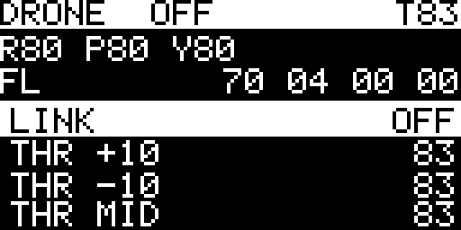

# Tay điều khiển thử nghiệm trên AK Base Kit 2.1

*07/10/2026. Một công cụ thử từng lệnh, không phải tay lái để bay: mỗi mục trong menu đổi một
trường hoặc một bit của gói 13 byte, để nhìn drone phản ứng với từng thứ một.*



## Phần cứng

| | |
|---|---|
| Bo | AK Base Kit 2.1, STM32L151C8 (64 KB), cấp nguồn và console qua USB Type-C (CH340) |
| Radio | nRF24L01+ hàn trên bo (CE PA8, CSN PB9, SPI1) |
| Màn hình | OLED 0,96" SSD1306, I2C `0x3C`, SCL PB13, SDA PB12 |
| Nút | Ba nút dưới màn hình: PB3, PC13, PB4 |
| Firmware | `ak-mcu-base`, nhánh `main` (commit `22396ce`), env `remote` (29 KB). Bản đã nạp: `firmware/kit21_remote_app_v1.3.7_2026-10-08.img` |

Nạp lại qua console, không cần ST-Link (LINK phải đang **OFF** khi nạp):

```
python tools/ak_fw.py --port COMx flash kit21_remote_app_v1.3.7_2026-10-08.img
```

## Ba nút

| Nút | Việc |
|---|---|
| Nút 1 | Xuống mục kế tiếp |
| Nút 2 | Lên mục trước |
| Nút 3, bấm | Thực hiện mục đang chọn |
| Nút 3, giữ 0,7 s | **Ga về `00` ngay**, bíp dài. Đây là thứ tay điều khiển gốc gửi khi kéo cần ga hết xuống |

## Màn hình

| Dòng | Nội dung |
|---|---|
| 1 (nền sáng) | `DRONE` · trạng thái liên kết `OFF` / `BIND` / `ON` · ga (`T83`) |
| 2 | Roll, pitch, yaw đang phát (`R80 P80 Y80`) |
| 3 | `FL` + byte 9, 10, 11, 12 đang phát |
| 4–7 | Menu, mục đang chọn tô ngược; bên phải là giá trị hiện tại |

## Menu (44 mục)

| # | Mục | Tác dụng |
|---|---|---|
| 0 | `LINK` | OFF → phát gói ghép cặp 0,4 s (hai địa chỉ) rồi phát gói điều khiển liên tục, 8 ms một gói. Bấm lần nữa: ngừng phát. **Luôn OFF khi bật nguồn** |
| 1–4 | `THR +10`, `THR -10`, `THR MID`, `THR 00` | Byte 3. Giữa là `83` |
| 5–7 | `ROLL`, `PITCH`, `YAW` | Mỗi lần bấm: `80` → `08` → `F7` → `80` |
| 8 | `SPEED` | Byte 10 bit 0–1: mức 1, 2, 3 |
| 9 | `LIGHT` | Byte 12 bit 7 |
| 10 | `FLIP 1s` | Byte 12 bit 0, bật 1 s rồi tự tắt |
| 11 | `HEADLESS` | Byte 10 bit 5 |
| 12 | `AVOID` | Byte 10 bit 7 |
| 13 | `RESET` | Byte 11 bit 0 |
| 14 | `RETURN` | Byte 11 bit 5 |
| 15 | `MID b7` | Byte 11 bit 7 — bit nút giữa bật lần đầu (đoán: cất cánh) |
| 16–19 | `B11.6`, `B11.4`, `B12.1` (xung 1 s), `B10.2` | Bit đã thấy trên sóng, chưa rõ nghĩa |
| 20–38 | `Bn.b` | Mọi bit còn lại của byte 9–12 |
| 39–42 | `B5 +4` … `B8 +4` | Bốn byte `20` |
| 43 | `DEFAULTS` | Trả cả gói về lúc hai cần ở giữa |

## Lệnh console `rc` (115200)

| Lệnh | Việc |
|---|---|
| `rc` | Trạng thái, mục đang chọn, gói đang phát |
| `rc 1` / `rc 2` / `rc 3` / `rc h` | Bấm nút 1 / 2 / 3 / giữ nút 3 |
| `rc go <n>` | Nhảy tới mục n |
| `rc dump` | Màn hình dưới dạng chữ (`tools/rc_screen.py` đổi thành PNG) |
| `rc lcd` | Dò bus màn hình và bus I2C1, đọc nút |
| `rc on` / `rc off` | Bật / tắt phát (không đảo trạng thái như mục `LINK`) |
| `rc p <13 byte hex>` | Đặt cả gói; byte 0 bị bỏ qua. App PC gửi lệnh này 20 lần mỗi giây |
| `rc wd <ms>` | Bộ canh: đang phát mà quá `<ms>` không có `rc p` thì kit tự phát ga `00`, hai cần giữa, bíp dài. `0` = tắt |
| `rc a 0` / `rc a 1` | `1`: byte 0 xen kẽ `DD` (PID lẻ) / `D5` (PID chẵn) như tay điều khiển gốc. `0` (mặc định): luôn `DD` |
| `rc t <ms>` | Khoảng cách giữa hai gói, 2–20 ms. Mặc định 8 và **nên để 8**: lệch 1 ms là drone hụt một phần tư số gói |

Ba lệnh `rc on/off`, `rc p`, `rc wd` (thêm 08/10/2026) là để app trên máy tính lái thay ba nút: xem
[`../software/pc/`](../software/pc/README.md).

## Đã kiểm (07/10, drone tháo motor và đèn, đọc phía drone qua SPI)

| Kiểm | Kết quả |
|---|---|
| Màn hình | Đã xác nhận đã lên hình. Ban đầu tối vì SSD1306 cần bật bơm điện áp (`8D 14`), khác SSD1309 của kit 3.0 |
| Bật `LINK` | Drone ghép cặp, đọc 17 gói `DD 80 80 83 80 20 20 20 20 70 04 00 00` trong 0,25 s, ba lần liên tiếp |
| Đổi ROLL, đèn, tốc độ, giữ nút 3 (qua `rc`) | Drone đọc đúng giá trị mới sau mỗi thao tác |
| Tắt `LINK` | Ngừng phát |

## Đã kiểm trên drone đủ motor và đèn (08/10)

| Kiểm | Kết quả |
|---|---|
| `LINK` bằng nút thật trên bo | Drone ghép cặp, đèn từ nháy sang sáng đứng |
| Đèn, headless, tránh vật cản, reset | Drone phản ứng đúng, xem bảng cờ trong [`protocol.md`](protocol.md) |
| Ga | Motor khởi động ở `C3`, giữ ở `83`, dừng ở `00`, khởi động lại được. Bốn motor ăn khoảng 1,05 A ở 4,2 V |
| Mất sóng (tắt `LINK` lúc motor quay) | Motor tắt, đèn chớp; bật `LINK` lại thì nối lại |
| Gói đặt từ máy tính (`rc p`) | Drone làm theo như với menu |

Lần thử có drone chạy bằng nguồn bàn chỉ ổn sau khi thêm tụ sát bo và rút ngắn dây: xem
[`bench-power.md`](bench-power.md).

## So với tay điều khiển gốc

Đo trên sóng bằng ESP-SDR ([`bench-power.md`](bench-power.md)): 13 byte lúc nghỉ trùng nhau, cùng
năm kênh và cùng thứ tự kênh. Khác ở ba chỗ:

- Độ lệch tần khoảng ±167 kHz (nRF24L01+) so với ±275 kHz.
- Tay gốc xen kẽ byte 0 `DD` / `D5` theo PID; bản này mặc định luôn gửi `DD` (`rc a 1` để xen kẽ).
- Một vòng năm kênh là 80,0 ms so với ước lượng 80,9 ms của tay gốc.

Drone vẫn ghép cặp, nhận 98% số gói và bay được. Bản này không nghe gói trả lời của drone.
