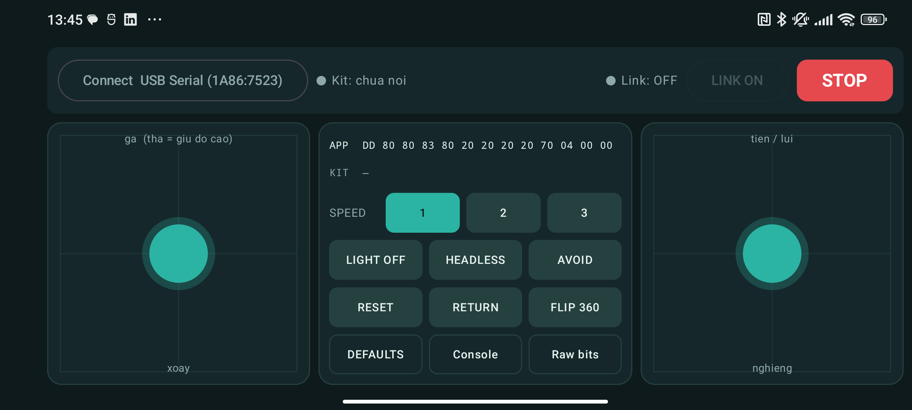
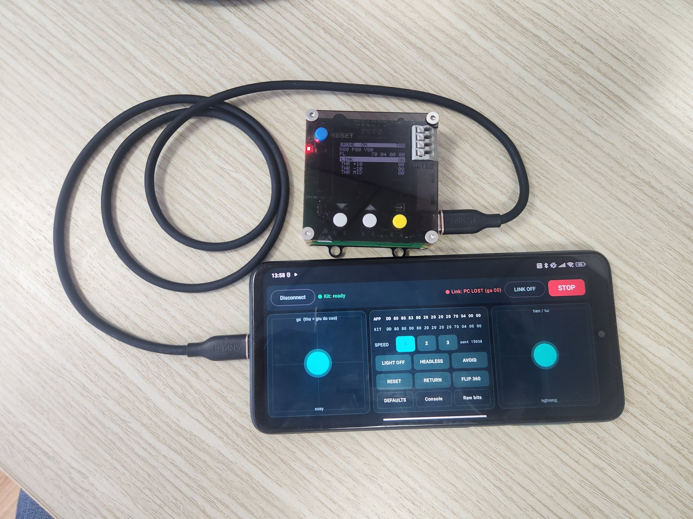

# Toy Drone Remote cho Android — điều khiển drone từ điện thoại

App Android (Kotlin + Jetpack Compose) làm cùng việc với [app PC](../pc/README.md): dựng gói 13 byte
từ hai cần ảo và các cờ, rồi đẩy sang [AK Base Kit 2.1](../../docs/remote-ak-kit-2.1.md) để kit phát
ra sóng 2,4 GHz.



*Ảnh chụp trên Redmi Note 9 Pro (Android 12), kit đã cắm qua OTG, chưa bấm Connect.*



*Điện thoại nối AK Base Kit 2.1 qua cáp USB-C, kit lấy nguồn từ điện thoại (09/10/2026). Kit đang phát (`LINK ON`); dòng đỏ `PC LOST (ga 00)` là bộ canh của kit vừa kéo ga về `00` vì hụt gói từ app — ảnh chụp trong buổi tìm lỗi rơi byte ở chiều kit → điện thoại, trước khi sửa (xem mục lỗi bên dưới).*

```
Dien thoai ──USB OTG──> CH340 ──UART 115200──> AK Base Kit 2.1 (nRF24L01+) ──2,4 GHz──> drone
      "rc p <13 byte>" 20 lan/giay                    mot goi moi 8 ms
```

## Tải về

**[ToyDroneRemote_v0.1.0-debug.apk](ToyDroneRemote_v0.1.0-debug.apk)** (11,8 MB) — bản thử, nằm ngay trong thư mục
này. Cùng file đó có ở trang phát hành
[android-v0.1.0-debug](https://github.com/hohoanganh/toy-drone-vty15/releases/tag/android-v0.1.0-debug).

Tải file về điện thoại, mở file và cho phép cài từ nguồn này. Đây là bản debug, ký bằng khoá debug
của máy build chứ chưa phải khoá phát hành: bản sau có thể không cài đè được, khi đó gỡ bản cũ rồi
cài lại. SHA-256 của file:
`504d268a9ac299cc6f8ade38f289113726a37b22960789de253c035112e9c71c`.

## Vì sao phải có kit ở giữa

**Điện thoại không nói trực tiếp được với drone.** Giao thức của drone là GFSK 1 Mbps khung kiểu
HS6200 với bảng xáo trộn và CRC riêng (xem [`docs/protocol.md`](../../docs/protocol.md)). Chip Wi-Fi/BT
của điện thoại không cho phát khung tùy ý trên các kênh đó — nó chỉ chạy đúng chuẩn của nó. Muốn
phát được gói này thì phải có một radio lập trình được, ở đây là nRF24L01+ trên kit.

Nên app Android **thay chỗ của app PC**, không thay chỗ của kit. Toàn bộ phần đã kiểm kỹ —
firmware kit, khung sóng, ghép cặp, nhảy tần — giữ nguyên không đổi một dòng.

Hệ quả phải chấp nhận: **điện thoại bị nối dây với kit khi bay.** Kit nhỏ, có thể dán cạnh điện
thoại hoặc buộc vào dây đeo. Nếu thấy vướng thì hướng đi tiếp là làm một cầu không dây
(ESP32 nhận BLE/WiFi từ điện thoại rồi nói sang cùng console `rc` này) — phần
đường truyền trong app đã tách sẵn ra interface cho
việc đó, chỉ thêm một lớp, `KitLink` và giao diện không phải sửa.

## Yêu cầu

| | |
|---|---|
| Điện thoại | Android 8.0 (API 26) trở lên, **có USB OTG** |
| Máy đã có sẵn | Redmi Note 9 Pro, Android 12 (API 31), arm64-v8a — nằm trong khoảng app hỗ trợ |
| Cáp | OTG USB-C sang USB-C (hoặc OTG + cáp của kit) |
| Kit | AK Base Kit 2.1 chạy bản build `remote` có lệnh `rc p` / `rc wd` — `firmware/kit21_remote_app_v1.3.7_2026-10-08.img` trở lên |
| Cầu USB-serial của kit | CH340, **đã đọc từ kit thật: `1A86:7523`** |
| Nguồn kit | Lấy từ điện thoại qua cáp OTG (kit ăn khoảng 50–100 mA) |

Điện thoại cấp nguồn cho kit nên pin tụt nhanh hơn bình thường. Máy nào không cấp được 5 V ra cổng
OTG thì phải dùng OTG có cổng cấp nguồn riêng.

### Hai bẫy khi thử trên Redmi / MIUI

- **Cổng USB chỉ có một.** Nạp app bằng `adb` qua cáp thì lúc đó điện thoại là *thiết bị*; cắm kit
  thì nó phải là *host*. Không làm được đồng thời trên cùng cổng. Cách gọn: bật **Wireless
  debugging** (Android 11+, máy này API 31 có) rồi `adb pair` / `adb connect` qua WiFi — cổng USB
  để trống cho kit, nạp lại app không cần rút gì.
- **MIUI tự tắt OTG** sau khoảng 10 phút không có thiết bị nào hoạt động. Nếu cắm kit mà app không
  thấy gì, vào *Cài đặt → Kết nối & chia sẻ → OTG* bật lại rồi bấm **Connect**.

## Dùng

1. Cắm kit vào điện thoại qua cáp OTG. Android hỏi quyền truy cập thiết bị USB → **Đồng ý**.
   (Cắm kit vào là Android tự mở app này, nhờ `device_filter.xml` khớp VID/PID của CH340.)
2. Nếu app đang mở sẵn thì bấm **Connect**. Chấm trạng thái phải hiện `Kit: ready`.
3. Bật nguồn drone, bấm **LINK ON**. Đèn drone chuyển từ nháy sang sáng đứng.
4. Điều khiển bằng hai cần:

| Cần | Trục |
|---|---|
| Trái, dọc | **Ga.** Thả tay thì về giữa (`0x83`) — drone giữ độ cao, **không** phải tắt motor |
| Trái, ngang | Xoay (yaw) |
| Phải, dọc | Tiến / lùi (pitch) |
| Phải, ngang | Nghiêng trái / phải (roll) |

Motor bắt đầu quay khi ga vượt `0xBF` (đo được: `BF` chưa quay, `C3` quay), tức cần trái đẩy lên
khoảng 50% trở lên.

**STOP** (nút đỏ góc trên phải): ga `00` trong 1,5 giây → motor dừng ngay. Đang bay thì drone rơi.

**Raw bits**: bật tắt từng bit của byte 9–12 để thử các bit chưa rõ nghĩa, như bảng cùng tên trên
app PC. **Console**: gõ mọi lệnh `rc` của kit và xem dòng trả về.

## An toàn

- **Thử lần đầu thì tháo cánh**, hoặc cố định drone thật chắc.
- Trong **Raw bits**, **B11 bit 4 dừng motor và tắt nguồn drone hẳn** (2/2 lần thử trên bàn), phải
  bấm nút nguồn trên drone mới bật lại. **B11 bit 7 dừng motor** mà drone vẫn bật. Chưa có bit nào
  được loại trừ là vô hại.
- Bộ canh nằm trong kit: app treo, bị tắt, **bị đẩy ra nền**, hay rút cáp quá 0,5 giây thì kit tự
  phát ga `00` và bíp dài (`Link: PC LOST`).
- App giữ màn hình luôn sáng khi đang mở. Dù vậy, cuộc gọi đến hoặc bấm Home giữa chuyến bay sẽ
  làm app ra nền → kit kéo ga về `00` → **drone rơi**. Đây là hệ quả không tránh được của việc điều khiển
  bằng điện thoại; không có cách nào bảo đảm một app Android luôn ở tiền cảnh.
- Đang phát sóng thì bấm Back lần đầu chỉ tắt LINK, không thoát app.
- Kit mất nguồn (rút cáp) thì drone mất sóng và tự tắt motor sau khoảng 2 giây.
- Chỉ thử trên thiết bị của chính mình.

## Đã kiểm và chưa kiểm (09/10/2026)

**Build xanh, 15/15 test đạt, app chạy trên điện thoại và nối được kit (`Kit: ready`).
Đã bay một chuyến có hạ cánh; chưa ghi nhận drone phản ứng từng trục thế nào.**

| Hạng mục | Tình trạng |
|---|---|
| Giao thức gói 13 byte | **Đã kiểm bằng test**: `PacketTest` port nguyên `software/pc/test_packet.py`, đối chiếu các giá trị đã đo trên sóng |
| `Proto.IDLE` | **Đã đối chiếu với kit thật**: dòng `pkt` kit trả về là `DD 80 80 83 80 20 20 20 20 70 04 00 00`, trùng từng byte |
| Regex đọc trạng thái kit | **Đã kiểm trên dòng thật**, không phải dòng tự dựng. Kit trả: `link 0 radio 1 lcd 1 sent 0 item 0/44 "LINK" = OFF wd 0 lost 0 t 8 alt 0` → đọc ra đúng cả sáu trường |
| Kit trên bàn | **Đã nối thử qua cổng COM của máy tính**: `radio 1` (thấy nRF24L01+), `lcd 1`, có trường `wd` nên firmware đúng là bản mới có `rc p` / `rc wd`, `t 8` (nhịp 8 ms), `alt 0` |
| Định dạng lệnh `rc p` | **Đã đối chiếu mã firmware**: parser trong `task_remote.c` nhận hex 13 byte, bỏ qua dấu cách, chữ thường hay in đều được, byte 0 bị bỏ qua. App gửi đúng định dạng `kit_link.py` đã dùng để bay thật |
| VID/PID trong `device_filter.xml` | **Đã đọc từ kit thật**: `USB\VID_1A86&PID_7523`, Windows nhận là "USB-SERIAL CH340" |
| Build | **Đã chạy, BUILD SUCCESSFUL.** AGP 9.4.1 nhận `compileSdk = 37` không cần chỉnh gì. APK debug 11,25 MB |
| Test | **15/15 đạt**: `PacketTest` 9 test, `KitStatusParseTest` 6 test, 0 lỗi |
| Nạp APK | **Được.** Lần đầu MIUI trả `INSTALL_FAILED_USER_RESTRICTED`; phải bật *Cài đặt qua USB* trong Developer options (cần đăng nhập tài khoản Mi). Sau đó nạp lại qua Wireless debugging cũng được, không cần rút kit |
| Driver CH340 phía Android | **Chạy được trên máy thật**: cắm kit qua OTG, điện thoại thấy `1A86:7523`, bấm Connect thì app báo `Kit: ready` (người thử xác nhận trên máy) |
| Giao diện | **Đã chạy, đã sửa một lỗi bố cục**: bản đầu dùng `Button` của Material (cao tối thiểu 48 dp) làm bảng giữa tràn, mất 2 byte cuối dòng `APP` và mất hẳn hàng `Console / Raw bits`. Đã thay bằng nút tự vẽ cao 38 dp; ảnh ở đầu trang là bản sau khi sửa |
| Log | `adb logcat -s ToyDrone` in mọi lệnh gửi (`TX>`), dòng kit trả (`RX<`) và sự kiện của app (`SYS`). Gói `rc p` chỉ ghi khi nội dung đổi |
| LINK ON / OFF | **Đã thử trên kit thật (chưa có drone xác nhận)**: `rc wd 500` + `rc on` → kit báo `link 3`, `sent` tăng khoảng 126 gói/giây; `rc off` → `link 0` |
| Bộ canh | **Đã thấy chạy**: app bị tắt lúc đang LINK ON → kit báo `lost 1`, gói chuyển sang ga `00` (`DD 80 80 00 80 ...`) |
| Điều khiển thật | **Đã bay một chuyến (09/10/2026, 14:26–14:29), có hạ cánh** theo lời người điều khiển. Log phía phát: `link 3` và `lost 0` suốt chuyến, nhịp `rc p` trung vị 55–60 ms, lớn nhất 83 ms; đã gửi ga `00`…`FF`, roll `2D`…`F5`, pitch `63`…`8B`, yaw `5E`…`C8`; cờ AVOID, RETURN, LIGHT OFF có bật. **Drone phản ứng từng trục đúng chiều hay không thì chưa ghi nhận** |
| STOP, FLIP, RESET, HEADLESS, Raw bits | **Chưa thử** |

### Lỗi đã lộ ra khi thử trên máy thật (đều đã sửa)

1. **Bấm LINK ON xong 1,07 giây sau app mới gửi `rc p` đầu tiên**, vì app chờ kit báo `link 3`
   mà trạng thái chỉ được hỏi mỗi giây. Trong lúc đó bộ canh 500 ms đã kịp báo `lost 1` và phát
   ga `00`. Sửa: app nhớ ý định của người điều khiển (`linkWanted`) và gửi ngay, không xét trạng thái kit.
2. **Sau `rc off` app vẫn gửi `rc p`** cho tới khi trạng thái cập nhật, và nút vẫn ghi `LINK OFF`
   nên phải bấm hai lần. Cùng nguyên nhân, cùng cách sửa.
3. **Đọc USB có thời hạn ngắn làm rơi byte.** Bản đầu đọc và ghi chung một luồng, mỗi vòng đọc
   với thời hạn 20 ms như `kit_link.py`. Trên Android, `bulkTransfer` hết hạn đúng lúc dữ liệu
   đang về thì phần dữ liệu đó mất. Đo được: thời hạn 20 ms → trong lúc bay chỉ 6/23 câu trả lời
   trạng thái còn nguyên, có dòng cụt giữa; hạ xuống 10 ms → **mọi** câu trả lời cụt đầu, 0/10 đọc
   được. Sửa: tách luồng đọc riêng, **đọc chặn** (timeout 0, driver dùng `UsbRequest`). Sau khi
   sửa: 13/13 câu trả lời nguyên vẹn lúc LINK tắt; lúc đang gửi gói thì **chưa đo lại**.
4. **Hai dòng lệnh gửi dính liền.** Bản đầu có thể gửi `rc` ngay sau một gói `rc p` trong cùng
   một vòng. Sửa: mỗi lượt chỉ gửi một dòng, cách nhau ít nhất 15 ms. Chưa tách được lỗi này
   với lỗi 3 xem phần nào gây mất câu trả lời; sửa cả hai.

Lỗi 3 chỉ ảnh hưởng chiều kit → điện thoại, tức phần hiển thị (dòng `KIT`, số `sent`). Chiều điều
khiển không bị: trong chuyến bay kit vọng lại nguyên vẹn 557/565 gói `rc p`.

### Còn ngờ: một đợt im lặng dài

Trong buổi thử có một đợt (13:51:47 → khoảng 13:57:34) app gửi `rc` mỗi giây mà không nhận lại
byte nào, kể cả tiếng vọng, qua cả hai lần cài lại app và mở lại cổng; chiều điện thoại → kit vẫn
chạy, kit không reset. Nhiều khả năng cũng do lỗi 3 nhưng **chưa chứng minh**: lúc đó chưa có log
thô. Nếu sau bản đọc chặn mà còn gặp lại thì nguyên nhân nằm chỗ khác (UART phát của kit, đường
CH340). Dù sao app không còn dựa vào trạng thái kit để quyết định gửi gói.

## Trong thư mục này

| Tệp | Việc |
|---|---|
| `ToyDroneRemote_v0.1.0-debug.apk` | File cài cho điện thoại |
| `README.md` | Trang này |

Repo chỉ để file cài. Mã nguồn (Kotlin + Jetpack Compose) là bản port của
[`../pc/packet.py`](../pc/packet.py) và [`../pc/kit_link.py`](../pc/kit_link.py), gửi cùng các lệnh `rc` xuống kit.
